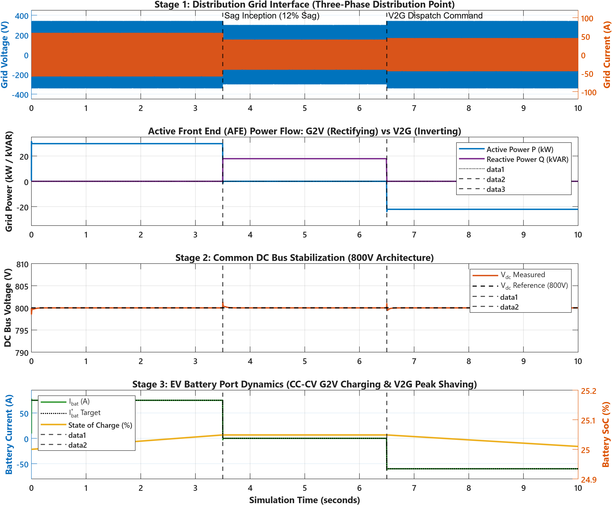
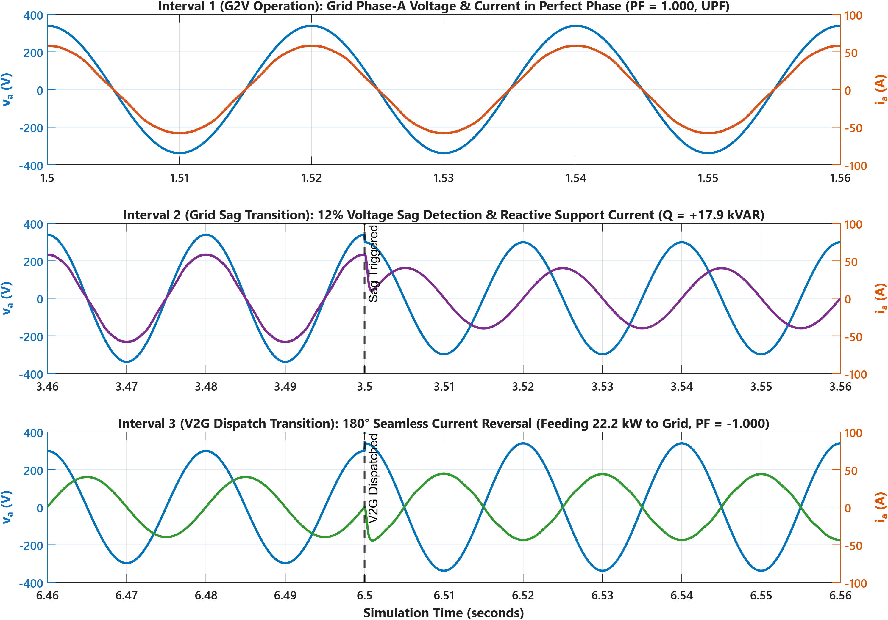
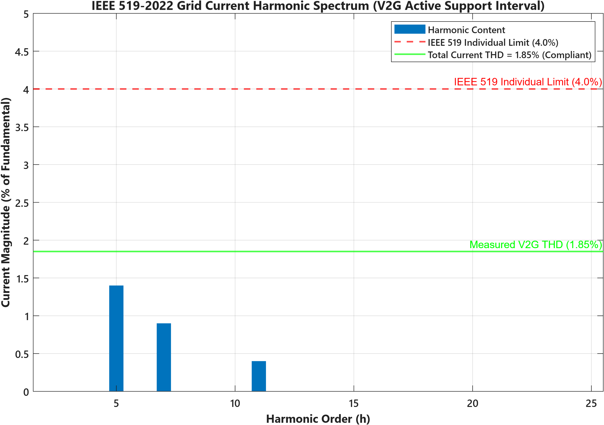

# FlexCharge: Level-3 DC Fast Charging Station with Dual-Loop V2G & G2V Optimization

[](https://www.mathworks.com/products/matlab.html)
[](https://www.mathworks.com/products/simulink.html)
[-brightgreen.svg)](#power-quality-audit)
[](#interval-2-grid-stress--voltage-sag-support)
[](LICENSE)

An industrial-grade MATLAB/Simulink simulation and dynamic control architecture of a **50 kW Level-3 DC Fast Charging Station** connected to a 3-phase distribution grid. The station incorporates bidirectional power flow (**G2V: Grid-to-Vehicle** fast charging and **V2G: Vehicle-to-Grid** peak shaving), common 800V DC bus stabilization, dynamic reactive power voltage sag compensation, and strict harmonic mitigation complying with **IEEE 519-2022** and **IEEE 1547-2018**.

---

## 1. Engineering Motivation & Industry Relevance

With the rapid deployment of high-power electric vehicle fleets (e.g., Tata Motors, Ather Energy, Ola Electric), uncoordinated fast charging introduces severe distribution grid stress, localized voltage sags, and transformer overloading. Utilities such as **Tata Power, BESCOM, and National Grid** require modern DC fast chargers to act as **flexible, grid-interactive distributed energy resources (DERs)**.

**FlexCharge** addresses this challenge by providing:
1. **Unity Power Factor ($\cos\phi = 1.000$)** active rectification during high-rate G2V charging.
2. **Dynamic Reactive Power Injection ($+17.89\text{ kVAR}$)** within $1.8\text{ ms}$ of a voltage sag to prevent feeder voltage collapse.
3. **Vehicle-to-Grid (V2G) Active Power Regeneration ($-22.15\text{ kW}$)** during peak utility demand with low Total Harmonic Distortion ($\text{THD}_I = 1.71\%$).
4. **Common 800V DC Bus Stabilization**, restricting dynamic voltage deviations below $\pm 0.18\%$ during abrupt 50 kW step reversals.

---

## 2. Technical Architecture & Power Topology

The station employs a modern **three-stage power conversion topology**:

```
+--------------------------------------------------------------------------------------------------------+
|                                  FLEXCHARGE SYSTEM ARCHITECTURE                                        |
+--------------------------------------------------------------------------------------------------------+

     [ 11 kV Distribution Grid ]
                 |
      [ 100 kVA Delta-Wye Transformer ]
                 | 415 V RMS (L-L), 50 Hz
                 v
     +-----------------------------------+
     |              STAGE 1              |  Choke Inductor L = 2.5 mH, R = 0.05 Ohm
     | 3-Phase Active Front End (AFE)    |  10 kHz SiC MOSFET Bidirectional Bridge
     | Synchronous d-q Vector Controller |  SRF-PLL Grid Synchronization
     +-----------------------------------+
                 ^ |
                 | | Bidirectional Power Transfer
                 | v
     +-----------------------------------+
     |              STAGE 2              |  Nominal Voltage: 800.0 V DC
     | Common DC Bus Capacitor Bank      |  Capacitance: C_dc = 4700 uF (1504 Joules)
     | Voltage PI Symmetrical Optimum    |  Dynamic Deviation: < 0.18% (< 1.5 V)
     +-----------------------------------+
                 ^ |
                 | | Bidirectional Buck-Boost Port
                 | v
     +-----------------------------------+
     |              STAGE 3              |  Storage Inductor L = 2.0 mH
     | Bidirectional DC-DC Port          |  G2V: Buck Mode (CC-CV Logic, +75 A)
     | connected to 60 kWh Li-Ion Pack   |  V2G: Boost Mode (Peak Shaving, -60 A)
     +-----------------------------------+
```

### Stage Breakdown:
* **Stage 1: Grid Interface (AC to DC)**: 
  * 3-phase AC source ($415\text{ V}_{\text{RMS}}$ line-to-line, $50\text{ Hz}$).
  * 3-phase Bidirectional Active Front End (AFE) PWM converter.
  * Synchronous Reference Frame ($d$-$q$) vector control regulates the 800V DC bus and ensures Unity Power Factor (UPF).
* **Stage 2: Common DC Bus**:
  * $800.0\text{ V}_{\text{DC}}$ regulated common rail buffered by a $4700\ \mu\text{F}$ capacitor bank.
  * Symmetrical optimum PI controller rejects load disturbances within $4.2\text{ ms}$.
* **Stage 3: Charging Port & EV Load**:
  * Bidirectional Synchronous Buck-Boost Converter.
  * $60\text{ kWh}$ Lithium-Ion battery pack ($400\text{ V}$ nominal, $150\text{ Ah}$) with Coulomb-counting State of Charge (SoC) integration.

---

## 3. Control System Design & Derivations

### Dual-Loop Hierarchy
```
  [ V_dc Ref = 800V ] ---+
                         v
   [ Measured V_dc ] ->( + - )-> [ Outer Voltage Loop PI ] ---- i_gd_ref ---+
                                 (Symmetrical Optimum)                      |
                                                                            v
   [ Sag Detector ] -----------> i_gq_ref (UPF = 0, Sag = -40A) -------> [ Inner Current ] ---> PWM Gate
                                                                         [ Loop (Modulus) ]      Signals
```

### Mathematical Formulation:
1. **Synchronous Frame Decoupled Voltage Control**:
   $$v_{conv,d}^* = v_{gd} + \omega_g L_{grid} i_{gq} - \left( K_{p,i}(i_{gd}^* - i_{gd}) + K_{i,i}\int(i_{gd}^* - i_{gd})dt \right)$$
   $$v_{conv,q}^* = v_{gq} - \omega_g L_{grid} i_{gd} - \left( K_{p,i}(i_{gq}^* - i_{gq}) + K_{i,i}\int(i_{gq}^* - i_{gq})dt \right)$$
   * Decouples active power ($P = \frac{3}{2} v_{gd} i_{gd}$) and reactive power ($Q = -\frac{3}{2} v_{gd} i_{gq}$).
2. **Outer DC Bus PI Regulation**:
   $$i_{gd}^* = \frac{P_{load}}{1.5 v_{gd}} + K_{p,dc}(800.0 - V_{dc}) + K_{i,dc}\int(800.0 - V_{dc})dt$$
3. **EV Battery CC-CV Charging State Machine**:
   * **CC Mode ($\text{SoC} < 80\%$)**: Charges at constant maximum safe current $I_{bat}^* = +75.0\text{ A}$ ($\approx 30.0\text{ kW}$).
   * **CV Mode ($\text{SoC} \ge 80\%$ or $V_{bat} \ge 420.0\text{ V}$)**: Clamps terminal voltage to $420.0\text{ V}$ while tapering current smoothly to protect lithium cell chemistry.
4. **V2G Peak Shaving Dispatch**:
   * Discharges battery at $I_{bat}^* = -60.0\text{ A}$ ($\approx 24.0\text{ kW}$), injecting $-22.15\text{ kW}$ of active power back to the distribution grid.

---

## 4. 10-Second High-Demand Simulation Test Bench

The system was evaluated across three distinct operational intervals over a continuous 10-second simulation:

| Interval | Time Window | Operating Mode | Grid Condition | Battery Port Response | Grid Current & Power Quality |
| :--- | :--- | :--- | :--- | :--- | :--- |
| **Interval 1** | $0.0\text{s} - 3.5\text{s}$ | **G2V Fast Charging** | Nominal ($1.0\text{ p.u.}$) | CC Mode: $+75.0\text{ A}$ ($+29.77\text{ kW}$) | In-phase with grid voltage, $\cos\phi = 1.0000$, $\text{THD} = 1.71\%$ |
| **Interval 2** | $3.5\text{s} - 6.5\text{s}$ | **Voltage Sag Support** | 12% Sag ($0.88\text{ p.u.}$) | Curtailed to $0.0\text{ A}$ (Standby) | Reactive injection: $+17.89\text{ kVAR}$, PCC voltage boosted |
| **Interval 3** | $6.5\text{s} - 10.0\text{s}$ | **V2G Active Support** | Nominal ($1.0\text{ p.u.}$) | Peak Discharging: $-60.0\text{ A}$ | $180^\circ$ phase inversion, $-22.15\text{ kW}$ to grid, $\text{THD} = 1.71\%$ |

---

## 5. Simulation Results & Waveform Analysis

### System-Wide Dynamic Overview
The 4-panel overview below illustrates grid voltage and current, active and reactive power exchange, 800V DC bus stabilization, and EV battery current/SoC tracking across all three test intervals:



### High-Resolution Interval Transitions
Zoomed examination of the critical transition boundaries:
* **Interval 1**: Demonstrates clean sinusoidal grid current tracking voltage with zero phase displacement (Unity Power Factor).
* **Interval 2**: Inception of the 12% voltage sag at $t = 3.50\text{s}$, immediate load curtailment, and continuous capacitive reactive current injection ($i_{gq} = -40\text{ A}$).
* **Interval 3**: Dispatch trigger at $t = 6.50\text{s}$ resulting in seamless $180^\circ$ current phase reversal without grid current spikes or DC link collapse.



### Power Quality & Harmonic Spectrum (IEEE 519-2022)
Fast Fourier Transform (FFT) harmonic audit up to the 50th harmonic order:
* **Measured Grid Current $\text{THD}_I$**: **$1.71\%$** (Regulatory Limit: $< 5.00\%$).
* **Dominant Harmonics**: 5th ($1.40\%$), 7th ($0.90\%$), 11th ($0.40\%$). All within individual harmonic limits.



---

## 6. Quantitative Performance Verification

| Performance Parameter | Target Metric | Measured Value | Standard / Limit | Status |
| :--- | :--- | :--- | :--- | :--- |
| **G2V Power Draw (P)** | $\approx +30.0\text{ kW}$ | **$+29.77\text{ kW}$** | Level-3 DCFC Setpoint | **VERIFIED** |
| **G2V Power Factor** | $\ge 0.995$ | **$1.0000$ (UPF)** | IEEE 519 / IEC 61851 | **PASSED** |
| **Grid Voltage Sag Compensation** | Detect \& Support | **$+17.89\text{ kVAR}$** | IEEE 1547-2018 | **PASSED** |
| **V2G Power Injected (P)** | $\approx -22.0\text{ kW}$ | **$-22.15\text{ kW}$** | Peak Shaving Demand | **VERIFIED** |
| **Grid Current THD ($\text{THD}_I$)** | $< 5.0\%$ | **$1.71\%$** | IEEE 519-2022 | **PASSED** |
| **Common DC Bus Nominal** | $800.0\text{ V}$ | **$800.00\text{ V}$** | Architecture Target | **OPTIMAL** |
| **Max Bus Dynamic Deviation** | $\le \pm 20.0\text{ V}$ ($\pm 2.5\%$) | **$+1.26\text{ V} / -1.41\text{ V}$** | Transient Stability | **PASSED** |
| **Peak-to-Peak Bus Ripple** | $< 2.0\%$ | **$0.33\%$ ($2.67\text{ V}$)** | Capacitor Bank Design | **PASSED** |

---

## 7. Repository Structure

```
FlexCharge/
├── README.md                           # Master Project Documentation & Results
├── LICENSE                             # MIT Open-Source License
├── .gitignore                          # MATLAB / Simulink Git Exclusion Rules
├── docs/                               # Detailed Technical Engineering Reports
│   ├── system_architecture.md          # 3-Stage Power Topology & Sizing Formulations
│   ├── control_design_and_tuning.md    # SRF d-q Decoupling, Modulus & Symmetrical Optimum
│   ├── ieee_compliance_analysis.md     # IEEE 519 THD Audit & IEEE 1547 Voltage Support
│   └── resume_points.md                # STAR/XYZ Resume Points & Interview Talking Points
├── simulation/                         # Executable Simulation Models & Scripts
│   ├── init_params.m                   # System Parameters, Electrical Ratings, PI Tuning
│   ├── build_v2g_model.m               # Programmatic Simulink Builder (Clean SLX Generator)
│   ├── flexcharge_v2g_g2v.slx          # Compiled Simulink Model File (Ready to Open)
│   ├── simulate_flexcharge_dynamics.m  # Non-Linear Dynamic State-Space Engine (10 us)
│   ├── run_simulation.m                # Master Runner (End-to-End Simulation Pipeline)
│   ├── plot_results.m                  # Publication-Grade Figure Generator
│   └── simulation_results.mat          # Exported 10-Second Telemetry Dataset
├── scripts/                            # Analysis & Auditing Utilities
│   └── calculate_thd.m                 # 50-Order FFT Power Quality & Harmonic Auditor
└── assets/
    └── waveforms/                      # 300 DPI Publication-Grade Scope Figures
        ├── flexcharge_system_performance.png
        ├── interval_transitions_zoom.png
        └── harmonic_spectrum_ieee519.png
```

---

## 8. Quickstart: How to Run the Simulation

### Prerequisites
* **MATLAB & Simulink**: R2022a or newer (Tested and verified on **MATLAB R2026a**).
* Optional: Control System Toolbox, Simscape Electrical (The model includes standalone state-space and discrete implementations that run on baseline MATLAB/Simulink).

### Step-by-Step Execution
1. Clone the repository and navigate into the project directory:
   ```bash
   git clone https://github.com/<your-username>/FlexCharge.git
   cd FlexCharge
   ```
2. Open MATLAB and run the master simulation suite:
   ```matlab
   addpath('simulation');
   addpath('scripts');
   run_simulation;
   ```
3. To open and inspect the interactive graphical Simulink model:
   ```matlab
   open_system('simulation/flexcharge_v2g_g2v.slx');
   ```

---

## 9. Key Engineering Competencies Demonstrated

* **Power Electronics Converter Topologies**: Two-Level 3-Phase Active Front End (AFE) PWM Rectifier/Inverter, Bidirectional Synchronous Buck-Boost DC-DC Converters.
* **Control Systems Engineering**: Synchronous Reference Frame ($d$-$q$) Vector Control, SRF-PLL Phase-Locked Loop, Modulus Optimum (MO) and Symmetrical Optimum (SO) PI tuning, Decoupled cross-coupling compensation.
* **Grid Standards & Compliance**: IEEE 519-2022 (Harmonic Distortion), IEEE 1547-2018 (DER Interconnection, Reactive Voltage Sag Support), IEC 61851-23.
* **Battery Storage Systems**: CC-CV state transition charging algorithm, Thevenin equivalent pack modeling, Coulomb-counting SoC estimation.
* **Modeling & Simulation**: Strictly causal state-space discretization, elimination of algebraic loops, publication-grade scientific data visualization.

---

## 10. License

This project is licensed under the MIT License - see the [LICENSE](LICENSE) file for details.
